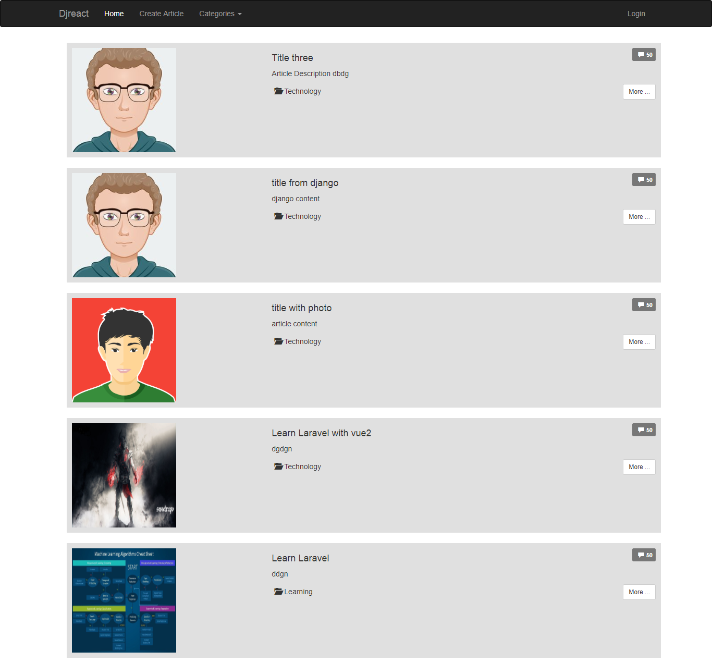

Django + Reactjs with authentication

## Screenshot


```

git clone https://github.com/manjurulhoque/DjReact.git
cd djreact
python manage.py runserver # for django
npm start # for reactjs
```

Now go to browser and goto
```
http://localhost:3000/
```